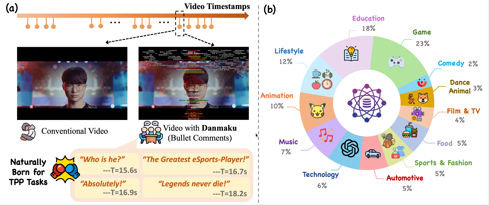
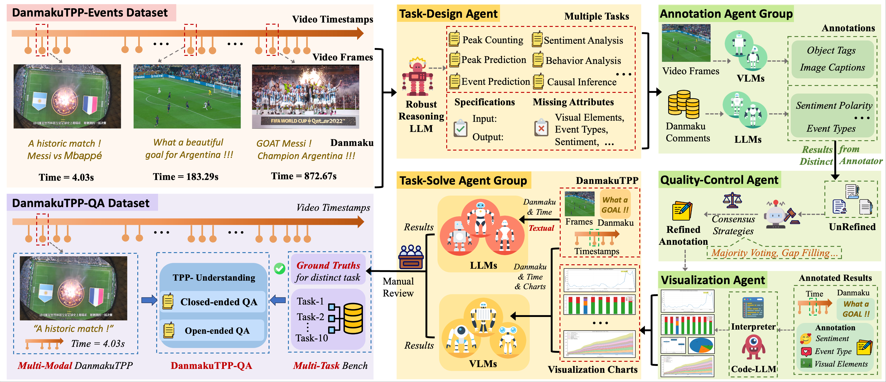

# DanmakuTPPBench: A Multi-modal Benchmark for Temporal Point Process Modeling and Understanding

[中文版](README_cn.md)

## Dataset Introduction
We introduce **DanmakuTPPBench**, a comprehensive benchmark designed to advance multi-modal Temporal Point Process (TPP) modeling in the era of Large Language Models (LLMs). 
While TPPs have been widely studied for modeling temporal event sequences, existing datasets are predominantly unimodal, hindering progress in models that require joint reasoning over temporal, textual, and visual information. To address this gap, **DanmakuTPPBench** comprises two complementary components:

(1) **DanmakuTPP-Events**, a novel dataset derived from the Bilibili video platform, where user-generated bullet comments (Danmaku) naturally form multi-modal events annotated with precise timestamps, rich textual content, and corresponding video frames;

(2) **DanmakuTPP-QA**, a challenging question-answering dataset constructed via a novel multi-agent pipeline powered by state-of-the-art LLMs and multi-modal LLMs (MLLMs), targeting complex temporal-textual-visual reasoning. 
We conduct extensive evaluations using both classical TPP models and recent MLLMs, revealing significant performance gaps and limitations in current methods’ ability to model multi-modal event dynamics. Our benchmark establishes strong baselines and calls for further integration of TPP modeling into the multi-modal language modeling landscape.

**For further details, please refer to our paper:**  Soon


---

(a) Comparison between conventional video viewing and Danmaku viewing experience. (b) The proportion of TPP data for video topics in **DanmakuTPPBench**.


---
Our framework for **DanmakuTPP-QA** construction.


---

## Dataset Download
Our **DanmakuTPPBench** (including DanmakuTPP-Events and DanmakuTPP-QA) can be downloaded from:

https://huggingface.co/datasets/FRENKIE-CHIANG/DanmakuTPP

The video frames corresponding to **DamakuTPPBench** can be download from:

https://pan.baidu.com/s/1gOBKxCw86siXJw6ePvTjTQ?pwd=dmtb

---

## Dataset Construction Details
1. **DanmakuTPP-Events** is sourced from the Top100 video creators in 2024:
https://www.bilibili.com/BPU2024

2. The framework template for **DanmakuTPP-QA** construction can be found in: `DanmakuTPP/dataset-construction/DanmakuTPP-QA/script`

---

## Evaluation Details
1. Evaluation of traditional TPP models:

      Building upon the **DanmakuTPP-Events** benchmark, the evaluation of traditional TPP models is conducted using the EasyTPP framework: https://github.com/ant-research/EasyTemporalPointProcess

2. Evaluation of LLMs & MLLMs:

      Building upon the **DanmakuTPP-Events** benchmark, the evaluation can refer to the script:
      <a href='https://github.com/FRENKIE-CHIANG/DanmakuTPPBench/blob/main/evaluation/DanmakuTPP-QA/inference.py'>inference.py</a> 
      for API-inference.

3. Evaluation metrics can be calculated as follows: 
<a href='https://github.com/FRENKIE-CHIANG/DanmakuTPPBench/blob/main/evaluation/DanmakuTPP-QA/eval/acc.py'>acc</a>, 
<a href='https://github.com/FRENKIE-CHIANG/DanmakuTTPBench/blob/main/evaluation/DanmakuTPP-QA/eval/task-8-acc-top2.py'>task8-acc</a>, 
<a href='https://github.com/FRENKIE-CHIANG/DanmakuTTPBench/blob/main/evaluation/DanmakuTPP-QA/eval/rmse.py'>rmse</a>

---

## Citation
If you find this dataset helpful in your research, please consider citing:
```bibtex
@misc{jiang2025danmakutppbench,
      title={DanmakuTPPBench: A Multi-modal Benchmark for Temporal Point Process Modeling and Understanding}, 
      author={Yue Jiang and Jichu Li and Yang Liu and Dingkang Yang and Feng Zhou and Quyu Kong},
      year={2025},
      arxiv = {}
      url={}
}
```
