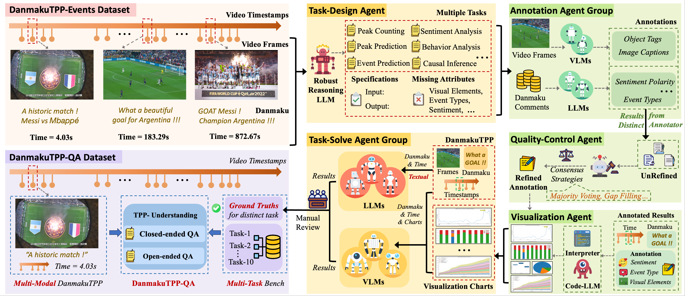

# DanmakuTPPBench: A Multi-modal Benchmark for Temporal Point Process Modeling and Understanding

## 数据集介绍
时间点过程（Temporal Point Process, TPP）领域中，现有的数据集主要局限于单模态范式，阻碍了需要联合推理时序、文本与视觉信息的模型发展。为填补这一空白，我们提出了一个多模态多任务的综合基准：**DanmakuTPPBench**，旨在推进LLM时代多模态时间点过程建模。

**DanmakuTPPBench**包含两个互补的数据集：
(1) **DanmakuTPP-Events**：源自bilibili视频平台的新型数据集，包含了该平台上视频中用户生成的实时弹幕文本，弹幕对应的时间戳、以及对应视频帧，形成了多模态事件序列；
(2) **DanmakuTPP-QA**：我们基于前沿大语言模型与多模态大语言模型，构建了multi-agent框架，构建了具有挑战性的问答数据集**DanmakuTPP-QA**。这是一个多模态、多任务、专注于复杂的时间-文本-视觉联合推理任务的数据集。
我们采用经典时序点过程模型与前沿多模态大语言模型进行系统性评估，揭示了现有方法在多模态事件动态建模方面存在的显著性能差距与局限性。本研究不仅建立了坚实的基准模型，更呼吁学界进一步将时序点过程建模深度整合到多模态语言建模的范式演进中。

**详情请参考我们的论文：** https://arxiv.org/pdf/2505.18411

---

图(a) 传统视频观看体验 vs 弹幕互动视频观看体验。图(b) **DanmakuTPPBench**中的TPP数据所属视频的主题占比。


---
**DanmakuTPP-QA** 的数据构造框架：


---

## 数据集下载
**DanmakuTPPBench** (包括 DanmakuTPP-Events和DanmakuTPP-QA)下载路径：

https://huggingface.co/datasets/FRENKIE-CHIANG/DanmakuTPP

**DanmakuTPPBench**中的图像数据可通过百度网盘下载：

https://pan.baidu.com/s/1gOBKxCw86siXJw6ePvTjTQ?pwd=dmtb

---

## 数据集构造
1. **DanmakuTPP-Events** 中的TPP数据基于b站2024百大up主2024年所发布的视频而构造：
https://www.bilibili.com/BPU2024

3. **DanmakuTPP-QA** 的构造框架可参考： `DanmakuTPP/dataset-construction/DanmakuTPP-QA/script`

---

## Benchmark评估
1. 评估传统时间点过程(TPP)模型能力：

    基于**DanmakuTPP-Events**，使用统一框架EasyTPP进行传统时间点过程(TPP)模型进行评估：https://github.com/ant-research/EasyTemporalPointProcess

2. 评估大语言模型（LLMs）和多模态大模型（MLLMs）能力：

    基于**DanmakuTPP-QA** 可以参考脚本：
    <a href='https://github.com/FRENKIE-CHIANG/DanmakuTPPBench/blob/main/evaluation/DanmakuTPP-QA/inference.py'>inference.py</a> 
    调用你所需要的模型api进行评估。

3. 评估指标的计算可参考： 
<a href='https://github.com/FRENKIE-CHIANG/DanmakuTPPBench/blob/main/evaluation/DanmakuTPP-QA/eval/acc.py'>acc</a>, 
<a href='https://github.com/FRENKIE-CHIANG/DanmakuTPPBench/blob/main/evaluation/DanmakuTPP-QA/eval/task-8-acc-top2.py'>task8-acc</a>, 
<a href='https://github.com/FRENKIE-CHIANG/DanmakuTPPBench/blob/main/evaluation/DanmakuTPP-QA/eval/rmse.py'>rmse</a>

---

## 引用
如果您在学术研究或项目中使用了本工作的代码、数据集或方法，请通过以下方式引用我们的工作：
```bibtex
@misc{jiang2025danmakutppbench,
      title={DanmakuTPPBench: A Multi-modal Benchmark for Temporal Point Process Modeling and Understanding}, 
      author={Yue Jiang and Jichu Li and Yang Liu and Dingkang Yang and Feng Zhou and Quyu Kong},
      year={2025},
      arxiv = {2505.18411}
      url={https://arxiv.org/abs/2505.18411}
}
```
